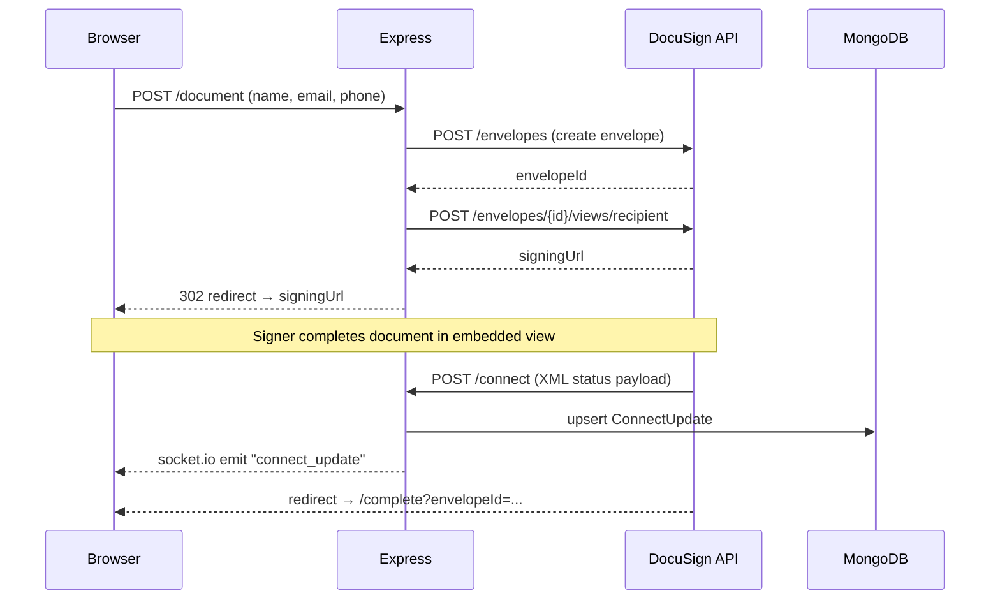

# DocuSign Node.js Demo

A full-stack Node.js web application demonstrating DocuSign eSignature API integration with real-time envelope status tracking via WebSockets.

## Overview

This project demonstrates how to build a complete DocuSign-integrated web application using Node.js and Express. It covers two envelope creation flows — uploading a document directly and using a pre-configured DocuSign template — alongside an embedded signing experience that keeps signers in-app. Envelope status updates are pushed to the browser in real time using Socket.io and persisted to MongoDB via Mongoose. Built as a learning project circa 2014 when the DocuSign REST API was relatively new.

## Features

- **Envelope creation from a document** — multipart POST upload of a `.docx` file with anchor-tag tab placement (`/S1Sign/`, `/S1Initial/`, etc.)
- **Envelope creation from a template** — composite template flow with server-side + inline template merging
- **Embedded signing** — signer stays within the app; DocuSign redirects back to `/complete` on completion
- **Optional phone/SMS authentication** — `requireIdLookup` trigger based on mobile number input
- **DocuSign Connect webhook receiver** — `/connect` endpoint parses inbound XML status payloads
- **Real-time status push** — Socket.io broadcasts `connect_update` events to all connected browsers the moment DocuSign fires a Connect notification
- **MongoDB persistence** — envelope status history stored and queryable via `ConnectUpdate` Mongoose model
- **Signed document download** — retrieve the completed PDF or the signing certificate by envelope ID
- **EJS server-side rendering** — four views: document demo, template demo, signing complete, Connect updates list
- **OpenShift and Heroku deployment configs** — `/.openshift/` action hooks and `Procfile` included

## Prerequisites

- **Node.js** >= 0.10.0 and npm >= 1.0.0
- **MongoDB** running locally or accessible via connection string
- **DocuSign developer account** — free sandbox at [developers.docusign.com](https://developers.docusign.com)
  - An Integrator Key (client ID)
  - A template ID if using the template demo flow
  - DocuSign Connect configured to POST to your `/connect` endpoint

## Setup

1. Clone the repository:

   ```bash
   git clone https://github.com/markjkelly/docusign-nodejs-demo.git
   cd docusign-nodejs-demo
   ```

2. Install dependencies:

   ```bash
   npm install
   ```

3. Configure credentials (see [Configuration](#configuration) below).

4. Start MongoDB (if running locally):

   ```bash
   mongod
   ```

5. Start the application:

   ```bash
   node server.js
   ```

## Configuration

Credentials are injected via environment variables. The application reads the following at startup:

| Variable | Description |
|---|---|
| `DS_EMAIL` | DocuSign account email address |
| `DS_PASSWORD` | DocuSign account password |
| `DS_INT_KEY` | DocuSign Integrator Key (client ID) |
| `MONGODB_CONNECT` | MongoDB connection string (e.g. `mongodb://localhost/docusign`) |
| `PORT` | HTTP port (defaults to `3000`) |

The `config.json` file at the repo root stores non-secret DocuSign configuration:

| Field | Description |
|---|---|
| `baseUrl` | DocuSign REST API base URL, including account ID |
| `templateId` | GUID of the DocuSign template used in the template demo |
| `templateRoleName` | Role name defined on the template (e.g. `"Signer"`) |

> ⚠️ **Do not commit credentials.** `DS_EMAIL`, `DS_PASSWORD`, and `DS_INT_KEY` must be supplied as environment variables, never hardcoded or committed to source control. The `config.json` in this repo contains only sandbox identifiers with no credentials.

## Running

```bash
node server.js
# => Express server listening on <ip>:3000
```

Open [http://localhost:3000](http://localhost:3000) in a browser.

| Route | Description |
|---|---|
| `GET /` or `GET /documentDemo` | Document-based envelope demo form |
| `GET /templateDemo` | Template-based envelope demo form |
| `POST /document` | Submit document envelope; redirects to embedded signing |
| `POST /template` | Submit template envelope; redirects to embedded signing |
| `GET /complete` | Post-signing return URL; shows envelope ID |
| `GET /downloadDocument?envelopeId=` | Download signed PDF |
| `GET /downloadCertificate?envelopeId=` | Download signing certificate PDF |
| `POST /connect` | DocuSign Connect webhook receiver |
| `GET /connectUpdates` | View all stored envelope status updates |

## Architecture

```
Browser
  │
  │  HTTP POST /document or /template (form submit)
  ▼
Express (server.js / app/routes.js)
  │
  │  DocuSign REST API (Header Auth)
  │  1. POST /envelopes          → create envelope, get envelopeId
  │  2. POST /envelopes/{id}/views/recipient  → get embedded signing URL
  ▼
DocuSign eSignature Platform
  │
  │  Signer completes / declines in embedded iFrame
  │  DocuSign Connect fires webhook → POST /connect
  ▼
Express /connect handler
  │  ├─ Parse XML payload (xml2js)
  │  ├─ Upsert ConnectUpdate document in MongoDB (Mongoose)
  │  └─ io.sockets.emit("connect_update", { envelopeId, envelopeStatus })
  ▼
Socket.io → all connected Browser clients (real-time status update)
```



## Deployment

### Heroku

A `Procfile` is included with the standard web process target:

```
web: node server.js
```

Set environment variables with `heroku config:set DS_EMAIL=... DS_PASSWORD=... DS_INT_KEY=... MONGODB_CONNECT=...`.

### OpenShift

The `/.openshift/` directory contains OpenShift action hooks and cron configuration for deployment on OpenShift v2. The server reads `OPENSHIFT_NODEJS_PORT` and `OPENSHIFT_NODEJS_IP` environment variables automatically.

## API Version Note

> Built against the DocuSign REST API circa 2014 using legacy Header Authentication (`X-DocuSign-Authentication`). The DocuSign eSignature REST API now uses OAuth 2.0 (Authorization Code Grant or JWT Grant). Header Authentication has been deprecated. See [developers.docusign.com](https://developers.docusign.com) for current SDKs, OAuth flows, and code samples.
